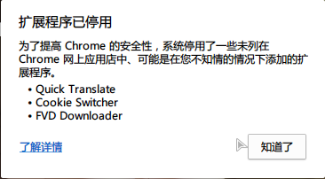
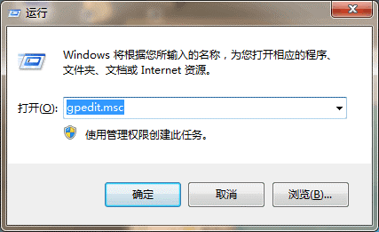
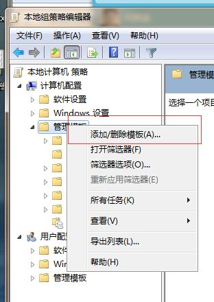
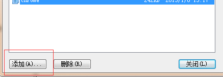
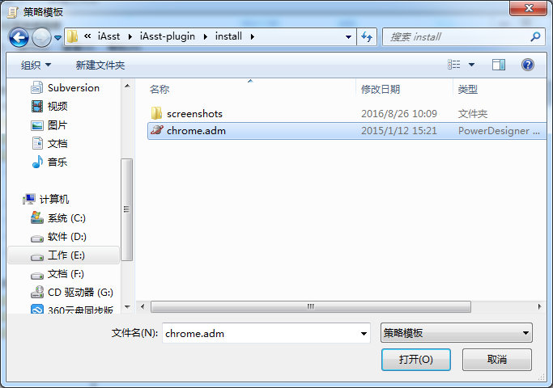
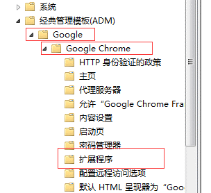
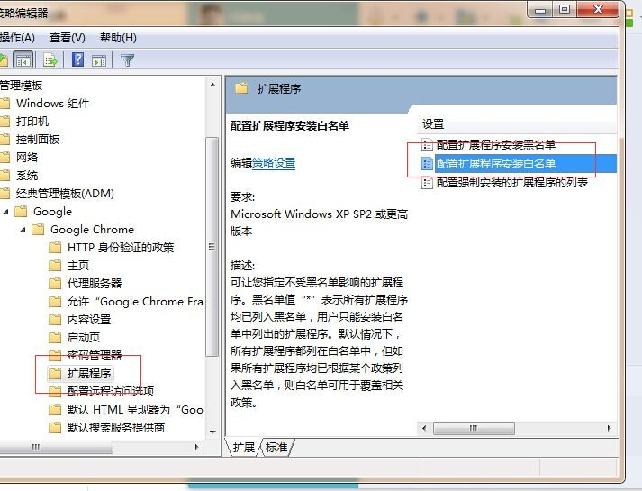
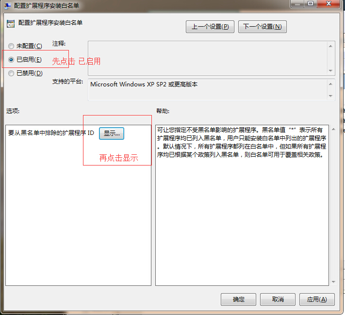
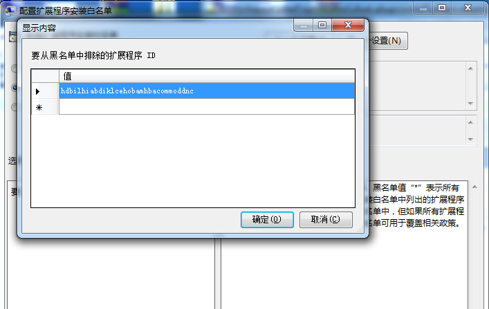
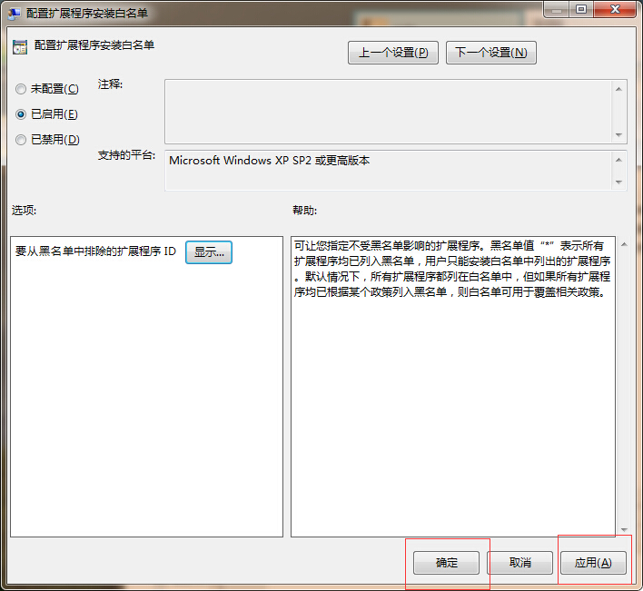

# 扩展程序已停用的解决方案

## 问题描述
在chrome插件通过拖动方式安装后，在下次启动后，chrome会弹出【扩展程序已停用】的提示，并将插件禁用
> 

## 解决过程

### 所需文件
1. chrome的组策略模版文件`chrome.adm`
2. 插件的ID`hdbilhiabdiklcehobamhbacommoddnc`

### 安装adm和配置的方法
1. win+R 打开运行窗口，输入 gpedit.msc，打开组策略编辑器
> 

2. 右键点击【管理模版】->【添加/删除模版】
> 

3. 在弹出框中点击【添加】
> 

4. 选中上面准备的【chrome.adm】文件，点击打开
> 

5. 回到编辑器，会出现【经典管理模版(ADM)】，展开它，点击【Google】->【Google Chrome】->【扩展程序】
> 

6. 双击右侧的【配置扩展程序安装白名单】
> 

7. 配置白名单，点击【已启用】，再点击下面的显示，打开添加白名单的列表
> 
 
8. 添加准备好的iAsst插件的ID
> 

9. 应用，保存即可
> 

10. 重新打开chrome，可以看到没有提醒了